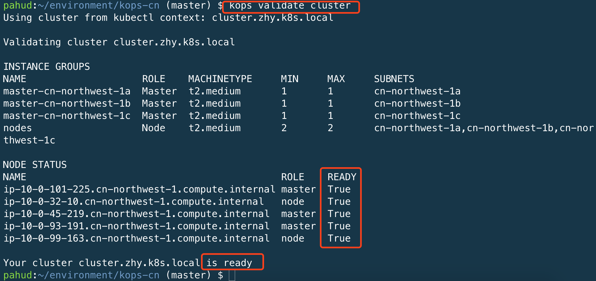
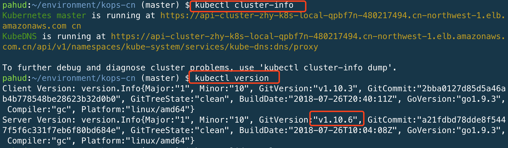

[English README](./README_en.md)

## 免责说明
建议测试过程中使用此方案，生产环境使用请自行考虑评估。<br>
当您对方案需要进一步的沟通和反馈后，可以联系 nwcd_labs@nwcdcloud.cn 获得更进一步的支持。<br>
欢迎联系参与方案共建和提交方案需求, 也欢迎在 github 项目issue中留言反馈bugs。    


# kops-cn项目介绍

本项目用于指导客户使用开源自动化部署工具Kops在AWS宁夏区域或北京区域搭建K8S集群。
本项目已经将K8S集群搭建过程中需要拉取的镜像或文件拉回国内，因此您无需任何翻墙设置。


# 特性
- [x] 集群创建过程中所需的docker镜像已存放在 **宁夏** 或 **北京** 区域的`Amazon ECR`中。
- [x] 集群创建过程中所需的二进制文件或配置文件已存放在 **北京** 区域的`Amazon S3`桶中 。
- [x] 简单快速的集群搭建和部署
- [x] 无需任何VPN代理或翻墙设置
- [x] 如有新的Docker镜像拉取需求，您可以创建Github push or pull request,您的request会触发**CodeBuild**([buildspec.yml](https://github.com/nwcdlabs/kops-cn/blob/master/buildspec.yml))  去拉取镜像并存放到AWS `cn-north-1` 的ECR中。查看： [镜像列表](https://github.com/nwcdlabs/kops-cn/blob/master/mirror/required-images.txt).
- [x] 一个`make create-cluster`命令即可创建集群


# 当前稳定版本

`kops-cn`专案保持跟[上游kops专案](https://github.com/kubernetes/kops)版本一致, 上游最新的kops版本可以在[kubernetes/kops/releases/latest](https://github.com/kubernetes/kops/releases/latest)查看, 而kops对应的建议k8s版本，则可以从[stable channels](https://raw.githubusercontent.com/kubernetes/kops/master/channels/stable)查看。此`README`文件最后一次更新时间所对应的稳定版本是：

|        | Kops最新版本 | K8s建议版本 |
| ------ | ------------ | ----------- |
| 版本号 | 1.12.2       | 1.12.8      |


# 步骤

1. 下载项目到本地
```
$ curl  https://github.com/nwcdlabs/kops-cn/archive/master.zip -L -o kops-cn.zip
$ unzip kops-cn
$ cd kops-cn-master
```

2. 在本机安装`kops` and `kubectl`命令行客户端： [安装指导](https://github.com/kubernetes/kops/blob/master/docs/install.md)

您也可以直接从以下链接的AWS中国区域的S3桶中下载 `kops` and `kubectl` 的二进制文件：

```bash
kops_version='1.12.2'
k8s_version='v1.12.8'
#
# for Linux Environment
#
# download kops for linux
$ curl -L https://s3.cn-north-1.amazonaws.com.cn/kops-bjs/fileRepository/kops/$kops_version/linux/amd64/kops -o kops
$ chmod +x $_

# download kubectl for linux
$ curl -L https://s3.cn-north-1.amazonaws.com.cn/kops-bjs/fileRepository/kubernetes-release/release/$k8s_version/bin/linux/amd64/kubectl -o kubectl
$ chmod +x $_

#
# for Mac OS X Environment
#

# download kops for mac os x
$ curl -L https://s3.cn-north-1.amazonaws.com.cn/kops-bjs/fileRepository/kops/$kops_version/darwin/amd64/kops -o kops
$ chmod +x $_

# download kubectl for mac os x
$ curl -L https://s3.cn-north-1.amazonaws.com.cn/kops-bjs/fileRepository/kubernetes-release/release/$k8s_version/bin/darwin/amd64/kubectl -o kubectl
$ chmod +x $_


#
# 将kops与kubectl放到$PATH
#
$ sudo mv ./kops /usr/local/bin/
$ sudo mv ./kubectl /usr/local/bin/

#
# 再次确认kops and kubectl是当前稳定版本
#
$ kops version
$ kubectl version	
```


## 请注意

如果你之前安装过kops客户端或者曾经升级了kops，请再次使用`kops version`确认kops客户端是否为最新稳定版本，版本不一致可能会造成功能上的问题。


3. 编辑 `Makefile`文件. 您需要设置如下变量


|        Name        |                    Description                     | values |
| :----------------: | :----------------------------------------------------------: | :------------------------: |
| **TARGET_REGION** | 选择将集群部署在aws北京或宁夏区域        |   **cn-north-1** or **cn-northwest-1**  |
| **AWS_PROFILE** | 选择制定其他不同的`AWS_PROFILE` | **default** |
| **KOPS_STATE_STORE** | 您需要提供一个S3桶给KOPS存放配置信息 | `s3://YOUR_S3_BUCKET_NANME` |
| **VPCID** | 选择将您的集群部署在哪个VPC中 | **vpc-xxxxxxxx** |
| **MASTER_COUNT** | master节点的机器数量 | **3** (建议不要修改) |
| **MASTER_SIZE** | master节点的机器类型 | |
| **NODE_SIZE** | 工作节点的机器类型 | |
| **NODE_COUNT** | 工作节点的机器数量 | |
| **SSH_PUBLIC_KEY** | 本地ssh公钥的存放路径(或参考[这里](https://github.com/nwcdlabs/kops-cn/issues/68#issuecomment-483879369)生成一个新的公钥) |**~/.ssh/id_rsa.pub** [default] |
| **KUBERNETES_VERSION** | 指定kubernetes版本 |(建议不要修改)  |
| **KOPS_VERSION** | 指定kops版本 | (建议不要修改) |

4. 创建集群
```
make create-cluster
```

5. 编辑集群
```
make edit-cluster
```

将 `spec.yml` 中内容贴到`spec` 下并保存退出。


6. 更新集群
```
make update-cluster
```

7. 完成


# 验证

集群的创建大概需要 3-5 分钟时间。之后，使用

```
kops validate cluster
```
或是
```
make validate-cluster
```

来验证集群是否是 `ready`状态。




查看集群对外接口信息、版本信息




恭喜您已顺利完成!

最后，您可以这样删除整个集群资源

```
make delete-cluster
```

# 插件安装
* Helm  - https://github.com/nwcdlabs/kops-cn/blob/master/doc/Helm.md
* Istio - https://github.com/nwcdlabs/kops-cn/blob/master/doc/Istio.md


# FAQ

## 集群验证失败?
查看 issue [#5](https://github.com/nwcdlabs/kops-cn/issues/5)

## 如何SSH上master节点和worker节点 ?
查看 issue [#6](https://github.com/nwcdlabs/kops-cn/issues/6)


## 我需要的docker镜像在ECR中不存在.
aws北京区域ECR中的镜像仓库`containerRegistry` 中的已有镜像见[required-images.txt](https://github.com/nwcdlabs/kops-cn/blob/master/mirror/required-images.txt), 如您在集群创建过程中需要其他镜像, 请您编辑 [required-images.txt](https://github.com/nwcdlabs/kops-cn/blob/master/mirror/required-images.txt) ，这将会在您的GitHub账户中 fork 一个新的分支，之后您可以提交PR（pull request）。 Merge您的PR会触发`CodeBuild` 去拉取 `required-images.txt` 中定义的镜像回ECR库。 数分钟后，您可以看到图标从`in progress`变为`passing`

当前状态：。

## 如何得知`required-images.txt`在ECR所对应的完整路径？
参考[这里](https://github.com/nwcdlabs/kops-cn/issues/54) 

### 查看所有FAQs [这里](https://github.com/nwcdlabs/kops-cn/issues?utf8=%E2%9C%93&q=label%3AFAQ)
