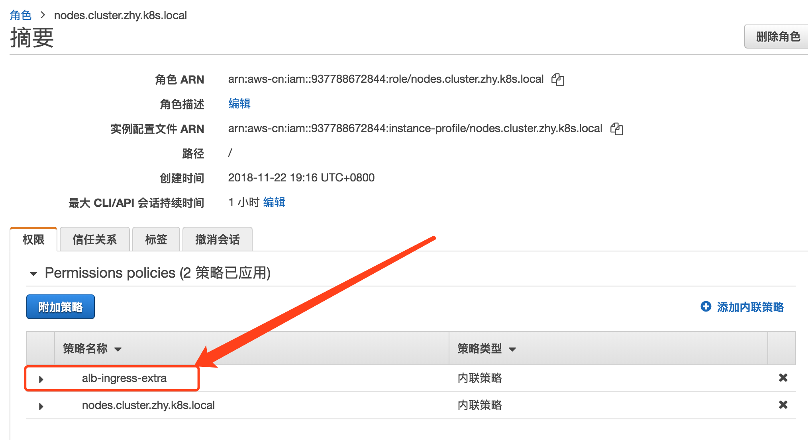
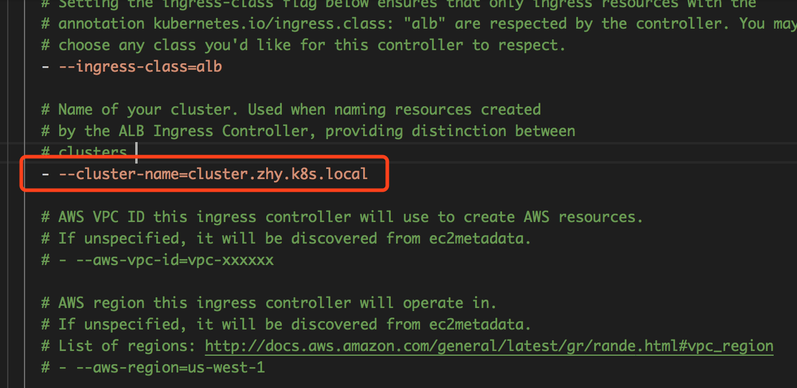
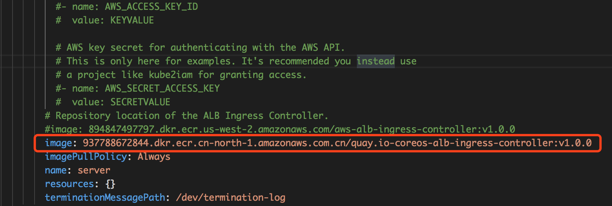
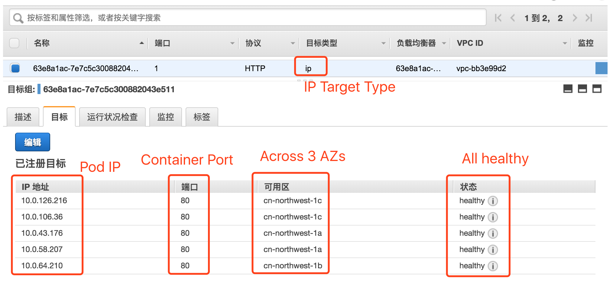

# AWS ALB Ingress

This document will walk you through the [AWS ALB Ingress Controller](https://github.com/kubernetes-sigs/aws-alb-ingress-controller) setup for Kops in China NingXia or Beijing region.


## How it works

**aws-alb-ingress-controller** watches the ingress resource changes from the k8s API and provision the ALB and TargetGroups respectively.


## Attach extra IAM policies for the nodes

Download the `iam-policy.json` from `kubernetes-sigs/aws-alb-ingress-controller` GitHub

```bash
curl -sS https://raw.githubusercontent.com/kubernetes-sigs/aws-alb-ingress-controller/v1.0.0/docs/examples/iam-policy.json -o iam-policy.json
```


check the node role name with `awscli`.  Typically if you create the cluster in `NingXia` region, the role name should be `nodes.cluster.zhy.k8s.local` 

```bash
$ aws --profile bjs iam list-roles | grep "nodes.cluster"
            "RoleName": "nodes.cluster.zhy.k8s.local",
            "Arn": "arn:aws-cn:iam::937788672844:role/nodes.cluster.zhy.k8s.local"
```


Attach `iam-policy.json` as extra role policy to the node role.

```bash
aws --profile bjs iam put-role-policy --role-name nodes.cluster.zhy.k8s.local --policy-name alb-ingress-extra --policy-document file://iam-policy.json
```


If you check IAM console, you will  see an extra role policy `alb-ingress-extra` was attached to this role.




Deploy RBAC Roles and RoleBindings needed by the AWS ALB Ingress controller:

```bash
kubectl apply -f https://raw.githubusercontent.com/kubernetes-sigs/aws-alb-ingress-controller/v1.0.0/docs/examples/rbac-role.yaml
```


Download the AWS ALB Ingress controller YAML into a local file:

```
curl -sS "https://raw.githubusercontent.com/kubernetes-sigs/aws-alb-ingress-controller/v1.0.0/docs/examples/alb-ingress-controller.yaml" > alb-ingress-controller.yaml
```

Edit the **–cluster-name** flag to be the real name of our Kubernetes (or) Amazon EKS cluster. If you deploy cluster in Ningxia, the cluster name by default would be **cluster.zhy.k8s.local**.




**IMPORTANT** - update the image URI to `937788672844.dkr.ecr.cn-north-1.amazonaws.com.cn/quay.io-coreos-alb-ingress-controller:v1.0.0`

(you need to update the image URI otherwise you may fail to pull the image)




OK. Let's deploy the alb-ingress-controller

```
kubectl apply -f alb-ingress-controller.yaml
```

Tail the logs

```
kubectl -n kube-system logs -f $(kubectl get po -n kube-system | egrep -o alb-ingress[a-zA-Z0-9-]+)
```

You should be able to see the following output

```
-------------------------------------------------------------------------------
AWS ALB Ingress controller
  Release:    v1.0.0
  Build:      git-6ee1276
  Repository: https://github.com/kubernetes-sigs/aws-alb-ingress-controller
-------------------------------------------------------------------------------
```

(please note the Release version and Build tag may change as it publishes newer version)


### Deploy Sample Application

```
kubectl apply -f https://raw.githubusercontent.com/kubernetes-sigs/aws-alb-ingress-controller/v1.0.0/docs/examples/2048/2048-namespace.yaml
kubectl apply -f https://raw.githubusercontent.com/kubernetes-sigs/aws-alb-ingress-controller/v1.0.0/docs/examples/2048/2048-deployment.yaml
kubectl apply -f https://raw.githubusercontent.com/kubernetes-sigs/aws-alb-ingress-controller/v1.0.0/docs/examples/2048/2048-service.yaml
```


Download the ingress resource YAML

```
curl -sS https://raw.githubusercontent.com/kubernetes-sigs/aws-alb-ingress-controller/v1.0.0/docs/examples/2048/2048-ingress.yaml -o 2048-ingress.yaml
```

Edit the `2048-ingress.yaml` file, add `alb.ingress.kubernetes.io/target-type: ip` in the annotations. In this case,  we will leverage the `ip mode` target-type to balance traffic directly across the Pods.


OK let's apply the ingress resource now.

```bash
kubectl apply -f 2048-ingress.yaml
```

Let's describe the ingress resource and get the `Address` attribute.

```
$ kubectl -n 2048-game describe ing/2048-ingress
Name:             2048-ingress
Namespace:        2048-game
Address:          63e8a1ac-2048game-2048ingr-6fa0-1771643810.cn-northwest-1.elb.amazonaws.com.cn
Default backend:  default-http-backend:80 (<none>)
Rules:
  Host  Path  Backends
  ----  ----  --------
  *
        /*   service-2048:80 (<none>)
Annotations:
  alb.ingress.kubernetes.io/scheme:                  internet-facing
  kubectl.kubernetes.io/last-applied-configuration:  {"apiVersion":"extensions/v1beta1","kind":"Ingress","metadata":{"annotations":{"alb.ingress.kubernetes.io/scheme":"internet-facing","kubernetes.io/ingress.class":"alb"},"labels":{"app":"2048-ingress"},"name":"2048-ingress","namespace":"2048-game"},"spec":{"rules":[{"http":{"paths":[{"backend":{"serviceName":"service-2048","servicePort":80},"path":"/*"}]}}]}}

  kubernetes.io/ingress.class:  alb
Events:                         <none>
```


Open the browser with `Address` as the URL and you'll see the 2048 game running.


Behind the scene if you check the ELB target group in AWS console, the target group would be `IP` target type balancing `HTTP` traffic to all Pod IP addresses across multiple AZs on container port `80`.  ELB Target Group should see all targets healthy as below:




## Clean up

```
$ kubectl delete ns/2048-game
namespace "2048-game" deleted

$ kubectl  -n kube-system delete deploy/alb-ingress-controller
deployment.extensions "alb-ingress-controller" deleted
```


#### 